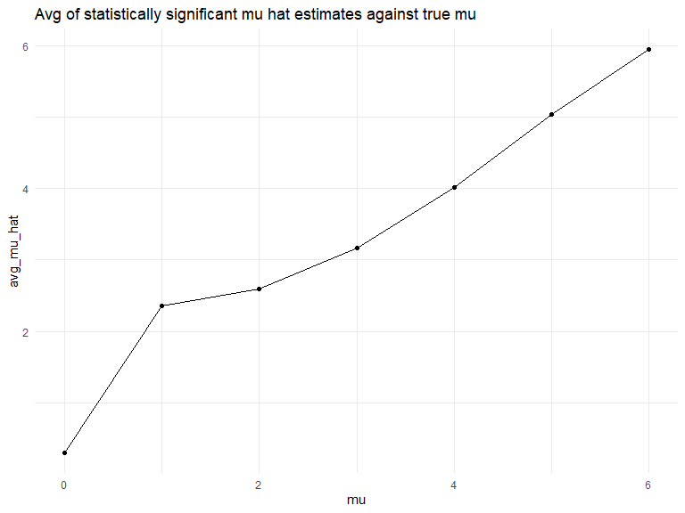

p8105_hw5_vc2692
================

``` r
library(tidyverse)
```

    ## ── Attaching core tidyverse packages ──────────────────────── tidyverse 2.0.0 ──
    ## ✔ dplyr     1.1.4     ✔ readr     2.1.5
    ## ✔ forcats   1.0.0     ✔ stringr   1.5.1
    ## ✔ ggplot2   3.5.2     ✔ tibble    3.2.1
    ## ✔ lubridate 1.9.4     ✔ tidyr     1.3.1
    ## ✔ purrr     1.1.0     
    ## ── Conflicts ────────────────────────────────────────── tidyverse_conflicts() ──
    ## ✖ dplyr::filter() masks stats::filter()
    ## ✖ dplyr::lag()    masks stats::lag()
    ## ℹ Use the conflicted package (<http://conflicted.r-lib.org/>) to force all conflicts to become errors

``` r
library(rvest)
```

    ## 
    ## Attaching package: 'rvest'
    ## 
    ## The following object is masked from 'package:readr':
    ## 
    ##     guess_encoding

``` r
library(broom)
library(knitr)

knitr::opts_chunk$set(
    echo = TRUE,
    warning = FALSE,
    fig.width = 8, 
  fig.height = 6,
  out.width = "90%"
)

theme_set(theme_minimal() + theme(legend.position = "bottom"))

options(
  ggplot2.continuous.colour = "viridis",
  ggplot2.continuous.fill = "viridis"
)

scale_colour_discrete = scale_colour_viridis_d
scale_fill_discrete = scale_fill_viridis_d
```

## Question 1

birthday problem

putting above into a function

``` r
bday_sim = function(n_room) {
  
  birthdays = sample(1:365, n_room, replace = TRUE)
  
  repeated_bday = length(unique(birthdays)) < n_room # if there is a repeat, this will be T
  
  repeated_bday 
}
```

want to repeat the function above multiple times

``` r
bday_sim_results = 
  expand_grid(
    group_size = 2:50,
    iter = 1:10000
  ) |> 
  mutate(
    result = map_lgl(group_size, bday_sim)
  ) |> 
  group_by(
    group_size
  ) |> 
  summarize(
    prob_repeat = mean(result)
  )
```

``` r
bday_sim_results |> 
  ggplot(aes(x = group_size, y = prob_repeat)) +
  geom_point() +
  geom_line()
```


In the above plot, we see that as the group_size for number of birthdays
in a room increases, the probability of having at least two people
sharing a birthday also increases. The graph follows a slight s curve.
There is an at least 50% probability that at leat two people in a room
share a birthday at a group size of about 23.

## Question 2

creating function and simulation dataframe for mu = 0

``` r
sim_mean = function(mu, n_subj = 30, sigma = 5) {
  
 
    x = rnorm(n = n_subj, mean = mu, sd = sigma)

  
    ttest_sim =
      t.test(x, mu = 0, conf.level = 0.95) |> 
      broom::tidy() |> 
      mutate(
        mu_hat = estimate,
        p_value = p.value
        ) |> 
      select(mu_hat, p_value)
    
      
 }
```

applying the function to get simulated data, with the repeats for mu =
0-6

``` r
sim_results_df = 
  expand_grid (
    mu = 0:6,
    iter = 1:500
    )|> 
  mutate(
    results = map(mu, sim_mean)
  ) |> 
  unnest(results)
```

``` r
sim_results_df = 
  sim_results_df |>
  group_by(
    mu
  ) |> 
  mutate(
    null_reject = p_value < 0.05,
    prop_reject = mean(null_reject)
  )
```

plot showing the proportion of times the null was rejected (the power of
the test) on the y axis and the true value of μ on the x axis. Describe
the association between effect size and power.

``` r
sim_results_df |> 
  ggplot(aes(x = mu, y = prop_reject)) +
  geom_point()
```


Make a plot showing the average estimate of μ^ on the y axis and the
true value of μ on the x axis.

``` r
sim_results_df |> 
  summarize(
    avg_mu_hat = mean(mu_hat)
  ) |> 
  ggplot(aes(x = mu, y = avg_mu_hat)) +
  geom_point() +
  geom_line() +
  labs(title = "Avg of all mu hat estimates against true mu" ) 
```


Make a second plot (or overlay on the first) the average estimate of μ^
only in samples for which the null was rejected on the y axis and the
true value of μ on the x axis.

``` r
sim_results_df |> 
  filter(
    null_reject == T
  ) |> 
  summarize(
    avg_mu_hat = mean(mu_hat)
  ) |> 
  ggplot(aes(x = mu, y = avg_mu_hat)) +
  geom_point() +
  geom_line() +
  labs(title = "Avg of statistically significant mu hat estimates against true mu" )
```



Is the sample average of μ^ across tests for which the null is rejected
approximately equal to the true value of μ? Why or why not?

The sample average of mu hat only for tests where the null is rejected
shows us the avg of sample means that significantly different from the
mu of the target population it was sampled from. For the lower mu
values, the sample means that are rejected are greater than their true
target mu which allows us to ascertain that the sample mu is different
from the target mu. However, as the mu of the target population
increases, the sample average of mu hats where the null is rejected gets
closer to the mu of the target population, demonstrating that we are
able to accurately reject those given increased effect size which leads
to increased power.

## Question 3

``` r
homicide_df =
  read_csv("data/homicide-data.csv", 
           na = c(".", "NA", "")) 
```

    ## Rows: 52179 Columns: 12
    ## ── Column specification ────────────────────────────────────────────────────────
    ## Delimiter: ","
    ## chr (9): uid, victim_last, victim_first, victim_race, victim_age, victim_sex...
    ## dbl (3): reported_date, lat, lon
    ## 
    ## ℹ Use `spec()` to retrieve the full column specification for this data.
    ## ℹ Specify the column types or set `show_col_types = FALSE` to quiet this message.

``` r
summary_homocides_df = 
 homicide_df |> 
  unite(city_state, city, state, sep = ", "  ) |> 
  filter(
    city_state != "Tulsa, AL"
  ) |> 
  group_by(city_state) |> 
  summarize(
    total_homicides = sum(disposition %in% c("Closed without arrest", "Open/No arrest", "Closed by arrest")),
    unsolved_homicides = sum(disposition %in% c("Closed without arrest", "Open/No arrest"))
  ) |> 
  kable()
```

The raw data includes information on the homocide victim, such as the
victom’s name, race, age, sex. It also includes the geographic location
(longitude and latitude) of the homicide, and the outcome of the case.
