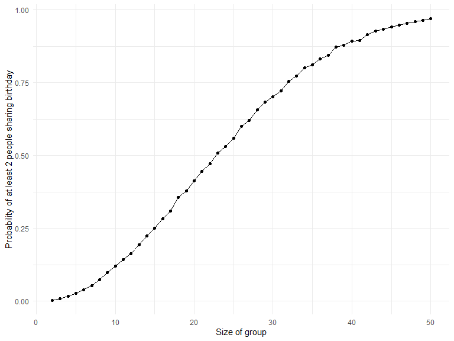
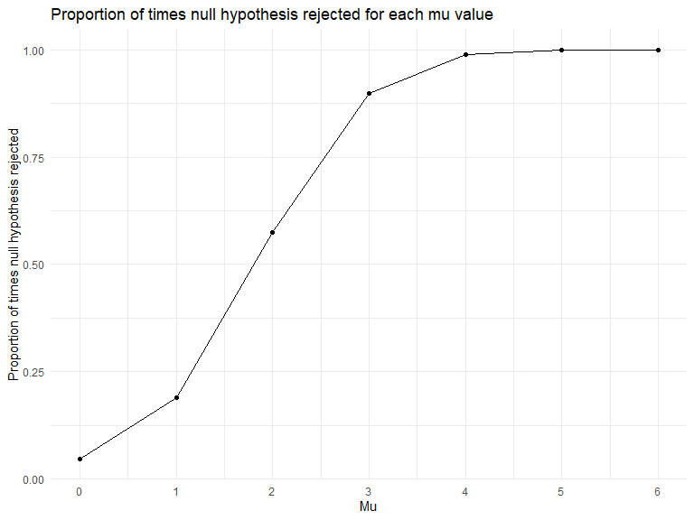
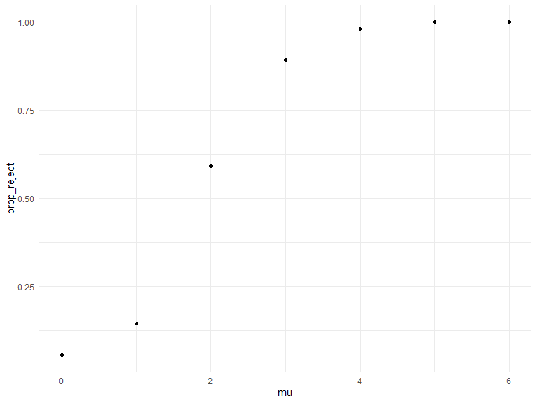
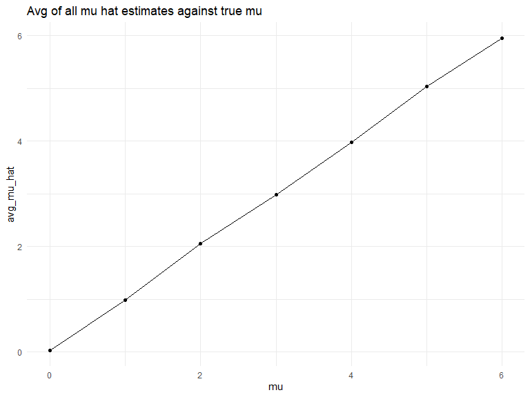
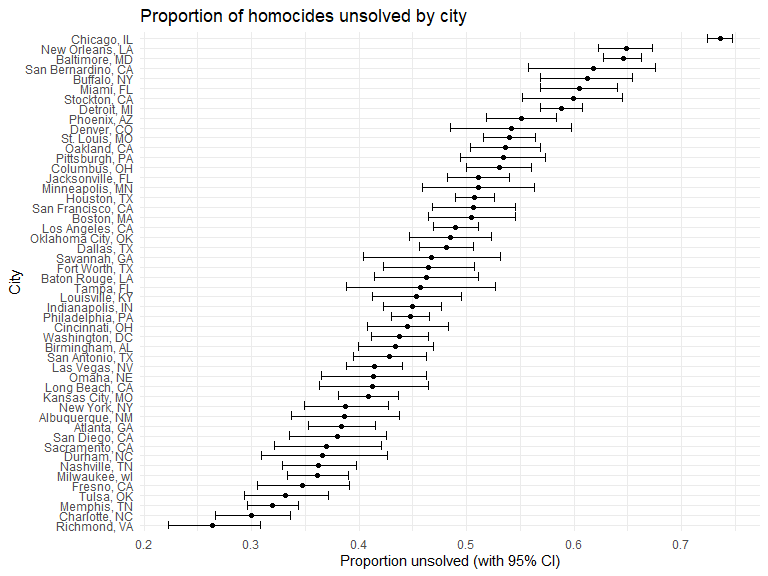

p8105_hw3_vc2692
================
Vaidehi Chudgar
2025-11-14

``` r
library(tidyverse)
```

    ## ── Attaching core tidyverse packages ──────────────────────── tidyverse 2.0.0 ──
    ## ✔ dplyr     1.1.4     ✔ readr     2.1.5
    ## ✔ forcats   1.0.0     ✔ stringr   1.5.1
    ## ✔ ggplot2   3.5.2     ✔ tibble    3.2.1
    ## ✔ lubridate 1.9.4     ✔ tidyr     1.3.1
    ## ✔ purrr     1.1.0     
    ## ── Conflicts ────────────────────────────────────────── tidyverse_conflicts() ──
    ## ✖ dplyr::filter() masks stats::filter()
    ## ✖ dplyr::lag()    masks stats::lag()
    ## ℹ Use the conflicted package (<http://conflicted.r-lib.org/>) to force all conflicts to become errors

``` r
library(rvest)
```

    ## 
    ## Attaching package: 'rvest'
    ## 
    ## The following object is masked from 'package:readr':
    ## 
    ##     guess_encoding

``` r
library(broom)
library(knitr)

knitr::opts_chunk$set(
    echo = TRUE,
    warning = FALSE,
    fig.width = 8, 
  fig.height = 6,
  out.width = "90%"
)

theme_set(theme_minimal() + theme(legend.position = "bottom"))

options(
  ggplot2.continuous.colour = "viridis",
  ggplot2.continuous.fill = "viridis"
)

scale_colour_discrete = scale_colour_viridis_d
scale_fill_discrete = scale_fill_viridis_d
```

## Question 1

Birthday Problem

First I create my function.

``` r
bday_sim = function(n_room) {
  
  birthdays = sample(1:365, n_room, replace = TRUE)
  
  repeated_bday = length(unique(birthdays)) < n_room # if there is a repeat, this will be T
  
  repeated_bday 
}
```

Next, I run this function 10,000 times for each group size between 2 and
50. I compute the probability that at least two people in the gruop will
share a birthday and plot this against group size.

``` r
bday_sim_results = 
  expand_grid(
    group_size = 2:50,
    iter = 1:10000
  ) |> 
  mutate(
    result = map_lgl(group_size, bday_sim)
  ) |> 
  group_by(
    group_size
  ) |> 
  summarize(
    prob_repeat = mean(result)
  )
```

``` r
bday_sim_results |> 
  ggplot(aes(x = group_size, y = prob_repeat)) +
  geom_point() +
  geom_line() +
  labs(
    x = "Size of group",
    y = "Probability of at least 2 people sharing birthday"
  )
```



In the above plot, we see that as the group_size for number of birthdays
in a room increases, the probability of having at least two people
sharing a birthday also increases. The graph follows a slight s curve.
There is an at least 50% probability that at least two people in a room
share a birthday at a group size of about 23.

## Question 2

Creating function and saving mu hat and p value from the t test.

``` r
sim_mean = function(mu, n_subj = 30, sigma = 5) {
  
 
    x = rnorm(n = n_subj, mean = mu, sd = sigma)

  
    ttest_sim =
      t.test(x, mu = 0, conf.level = 0.95) |> 
      broom::tidy() |> 
      mutate(
        mu_hat = estimate,
        p_value = p.value
        ) |> 
      select(mu_hat, p_value)
    
      
 }
```

Applying the function to 5000 iterations for different my values.

``` r
sim_results_df = 
  expand_grid (
    mu = 0:6,
    iter = 1:5000
    )|> 
  mutate(
    results = map(mu, sim_mean)
  ) |> 
  unnest(results) |> 
  group_by(
    mu
  ) |> 
  mutate(
    null_reject = p_value < 0.05,
    prop_reject = mean(null_reject)
  )
```

Below is a plot showing the proportion of times the null was rejected
(the power of the test) on the y axis and the true value of μ on the x
axis.

``` r
sim_results_df |> 
  ggplot(aes(x = mu, y = prop_reject)) +
  geom_point() + 
  geom_line() +
  scale_x_continuous(breaks = unique(sim_results_df$mu))+
  labs(
    title = "Proportion of times null hypothesis rejected for each mu value",
    x = "Mu",
    y = "Proportion of times null hypothesis rejected"
  )
```



The above plot shows us that it is very difficult to accurately reject
the null hypothesis correctly when mu is low because the effect size is
small. When the effect size is small there is low power. However, as mu
increase out effect size increases, the effect size gets larger because
most mean estimates are much farther from 0 since they are coming from
target populations of 3, 4, 5, 6. For t tests where mu is these larger
values, we have more power because it is easier to detect a difference
from the null of mu = 0.

Below, I make a plot showing the average estimate of μ^ on the y axis
and the true value of μ on the x axis.

``` r
sim_results_df |> 
  summarize(
    avg_mu_hat = mean(mu_hat)
  ) |> 
  ggplot(aes(x = mu, y = avg_mu_hat)) +
  geom_point() +
  geom_line() +
  labs(title = "Average of all mean estimates against true mean",
       x = "Mu",
       y = "Average mean estimate") 
```



Here is a plot of the average estimate of mu hat only in samples for
which the null was rejected on the y axis and the true value of μ on the
x axis.

``` r
sim_results_df |> 
  filter(
    null_reject == T
  ) |> 
  summarize(
    avg_mu_hat = mean(mu_hat)
  ) |> 
  ggplot(aes(x = mu, y = avg_mu_hat)) +
  geom_point() +
  geom_line() +
  labs(title = "Average of statistically significant mean estimates against true mean",
       x = "Mu",
       y = "Average mean estimates where null hypothesis rejected")
```



The sample average of mu hat only for tests where the null is rejected
shows us the avg of sample means that are significantly different from
the mu of the target population it was sampled from. For the lower mu
values, the sample means that are rejected are greater than their true
target mu which allows us to ascertain that the sample mu is different
from the target mu. However, as the mu of the target population
increases, the sample average of mu hats where the null is rejected gets
closer to the mu of the target population, demonstrating that we are
able to accurately reject those given increased effect size which leads
to increased power.

## Question 3

Below I read in the homicides dataset.

``` r
homicide_df =
  read_csv("data/homicide-data.csv", 
           na = c(".", "NA", "")) 
```

    ## Rows: 52179 Columns: 12
    ## ── Column specification ────────────────────────────────────────────────────────
    ## Delimiter: ","
    ## chr (9): uid, victim_last, victim_first, victim_race, victim_age, victim_sex...
    ## dbl (3): reported_date, lat, lon
    ## 
    ## ℹ Use `spec()` to retrieve the full column specification for this data.
    ## ℹ Specify the column types or set `show_col_types = FALSE` to quiet this message.

The raw data includes information on the homicide victim, such as the
victim’s name, race, age, sex. It also includes the geographic location
(longitude and latitude) of the homicide, and the outcome of the
case.There are 52179 individuals included and 12 variables included.

``` r
 homicide_df |> 
  unite(city_state, city, state, sep = ", "  ) |> 
  filter(
    city_state != "Tulsa, AL"
  ) |> 
  group_by(city_state) |> 
  summarize(
    total_homicides = sum(disposition %in% c("Closed without arrest", "Open/No arrest", "Closed by arrest")),
    unsolved_homicides = sum(disposition %in% c("Closed without arrest", "Open/No arrest"))
  ) |> 
  kable()
```

| city_state         | total_homicides | unsolved_homicides |
|:-------------------|----------------:|-------------------:|
| Albuquerque, NM    |             378 |                146 |
| Atlanta, GA        |             973 |                373 |
| Baltimore, MD      |            2827 |               1825 |
| Baton Rouge, LA    |             424 |                196 |
| Birmingham, AL     |             800 |                347 |
| Boston, MA         |             614 |                310 |
| Buffalo, NY        |             521 |                319 |
| Charlotte, NC      |             687 |                206 |
| Chicago, IL        |            5535 |               4073 |
| Cincinnati, OH     |             694 |                309 |
| Columbus, OH       |            1084 |                575 |
| Dallas, TX         |            1567 |                754 |
| Denver, CO         |             312 |                169 |
| Detroit, MI        |            2519 |               1482 |
| Durham, NC         |             276 |                101 |
| Fort Worth, TX     |             549 |                255 |
| Fresno, CA         |             487 |                169 |
| Houston, TX        |            2942 |               1493 |
| Indianapolis, IN   |            1322 |                594 |
| Jacksonville, FL   |            1168 |                597 |
| Kansas City, MO    |            1190 |                486 |
| Las Vegas, NV      |            1381 |                572 |
| Long Beach, CA     |             378 |                156 |
| Los Angeles, CA    |            2257 |               1106 |
| Louisville, KY     |             576 |                261 |
| Memphis, TN        |            1514 |                483 |
| Miami, FL          |             744 |                450 |
| Milwaukee, wI      |            1115 |                403 |
| Minneapolis, MN    |             366 |                187 |
| Nashville, TN      |             767 |                278 |
| New Orleans, LA    |            1434 |                930 |
| New York, NY       |             627 |                243 |
| Oakland, CA        |             947 |                508 |
| Oklahoma City, OK  |             672 |                326 |
| Omaha, NE          |             409 |                169 |
| Philadelphia, PA   |            3037 |               1360 |
| Phoenix, AZ        |             914 |                504 |
| Pittsburgh, PA     |             631 |                337 |
| Richmond, VA       |             429 |                113 |
| Sacramento, CA     |             376 |                139 |
| San Antonio, TX    |             833 |                357 |
| San Bernardino, CA |             275 |                170 |
| San Diego, CA      |             461 |                175 |
| San Francisco, CA  |             663 |                336 |
| Savannah, GA       |             246 |                115 |
| St. Louis, MO      |            1677 |                905 |
| Stockton, CA       |             444 |                266 |
| Tampa, FL          |             208 |                 95 |
| Tulsa, OK          |             583 |                193 |
| Washington, DC     |            1345 |                589 |

The above table shows the total number of homicides and number of
unsolved homicides for each city.

**Prop.test for Baltimore, MD**

``` r
baltimore_df =
  homicide_df |> 
  unite(city_state, city, state, sep = ", "  ) |> 
  filter(
    city_state == "Baltimore, MD",
  ) |> 
  summarize(
    total_homicides = sum(disposition %in% c("Closed without arrest", "Open/No arrest", "Closed by arrest")),
    unsolved_homicides = sum(disposition %in% c("Closed without arrest", "Open/No arrest"))
  )
```

``` r
baltimore_prop_test =  
  prop.test(
    x = baltimore_df |> pull(unsolved_homicides),
    n = baltimore_df |> pull(total_homicides)
    ) |> 
  broom::tidy() |> 
  select(
    proportion_unsolved = estimate,
    ci_lower_limit = conf.low,
    ci_upper_limit = conf.high
  )
```

**Prop.test for all cities in dataset**

``` r
run_prop_test = function(unsolved, total) {
  prop.test(x = unsolved, n = total) |>
    broom::tidy() |>
    select(
      proportion_unsolved = estimate,
      ci_lower_limit      = conf.low,
      ci_upper_limit      = conf.high
    )
}

prop_test_df =
  homicide_df |> 
  unite(city_state, city, state, sep = ", ") |> 
  filter(city_state != "Tulsa, AL") |> 
  group_by(city_state) |> 
  summarize(
    total_homicides = sum(disposition %in% c("Closed without arrest", "Open/No arrest", "Closed by arrest")),
    unsolved_homicides = sum(disposition %in% c("Closed without arrest", "Open/No arrest"))
  ) |> 
  mutate(
    output = map2(
      unsolved_homicides,
      total_homicides,
      run_prop_test
    )
  ) |> 
  unnest(output) |> 
  select(city_state, proportion_unsolved, ci_lower_limit, ci_upper_limit)
```

Below, I create a plot that shows the estimates and CIs for each city.

``` r
prop_test_df |> 
  ggplot(aes(
    x = proportion_unsolved, 
    y = reorder(city_state, proportion_unsolved)
  )) +
  geom_point() +
  geom_errorbar(aes(
    xmin = ci_lower_limit,
    xmax = ci_upper_limit
  )) +
  labs(
    title = "Proportion of homocides unsolved by city",
    x = "Proportion unsolved (with 95% CI)",
    y = "City"
  )
```


